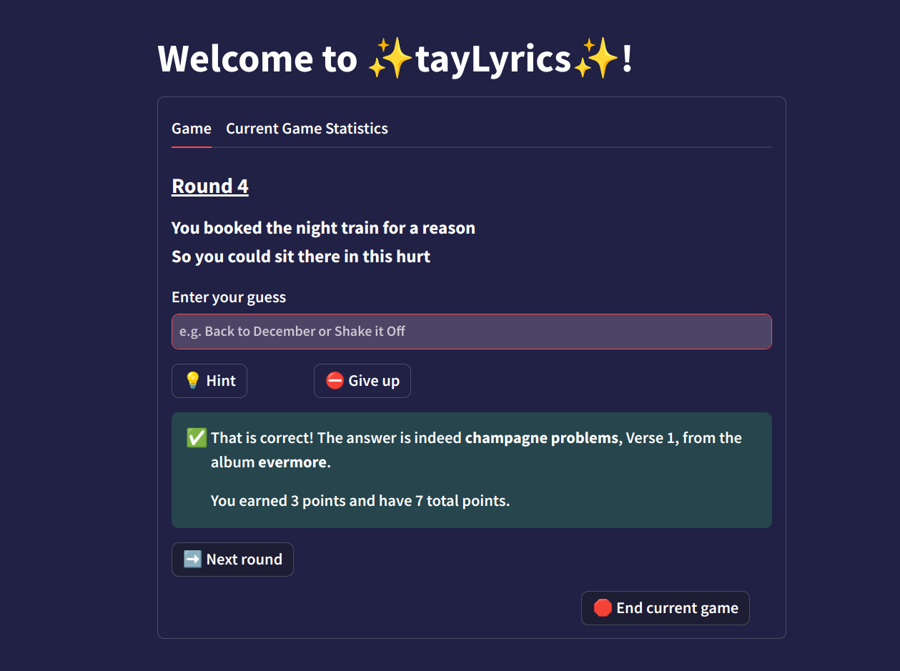

# ✨tayLyrics✨

### 📃 About 
tayLyrics is a lyrics-guessing game that aims to assess how well you - a presumptive Swiftie - know Taylor Swift's lyrics. The app generates a lyric and your goal is to guess the song it comes from.

As of July 2024, tayLyrics is updated to contain lyrics up to and including *THE TORTURED POETS DEPARTMENT*, as well as all Taylor's Version albums and vault tracks.
* *Sept. 29: I will update the game to include lyrics from The Life of a Showgirl as soon as they become available!*

[Here](https://taylyrics.lyriguessr.xyz/) is the link to the game. Good luck and have fun!

### ⚔️ The Game
tayLyrics has 3 difficulty levels: Easy generates a whole section of lyrics (e.g. the entire chorus), Medium generates 2 lines, and Hard generates 1 line. You earn points for each lyric you guess correctly; the higher the difficulty, the more points you get.

If you don't have a guess, you can ask for a hint - there are three hints available for each generated lyric. These hints yield the lyric's album, next line, and previous line, respectively. Or, you could also choose to give up and move on to the next round. But keep in mind that getting hints and giving up will cost you points!

You can choose to play in Casual (unlimited lives) or Survival (5 lives) mode. In the latter, the stakes are upped - any time you answer incorrectly or give up, you lose a life. Your goal is to make it as many rounds as you can without losing all 5 of your lives, while also making sure not to use too many hints, because those will cost you points. 

If you play in Survival mode and have all albums enabled in the Advanced Options, you can choose to record your game scores in the leaderboard and see how you match up with other Swifties!

#### Points breakdown

Additions: 

* Easy correct guess: +1
* Medium correct guess: +3
* Hard correct guess: +5

Deductions:

* Hint: -1
* Incorrect guess: -1
* Giving up: -2
